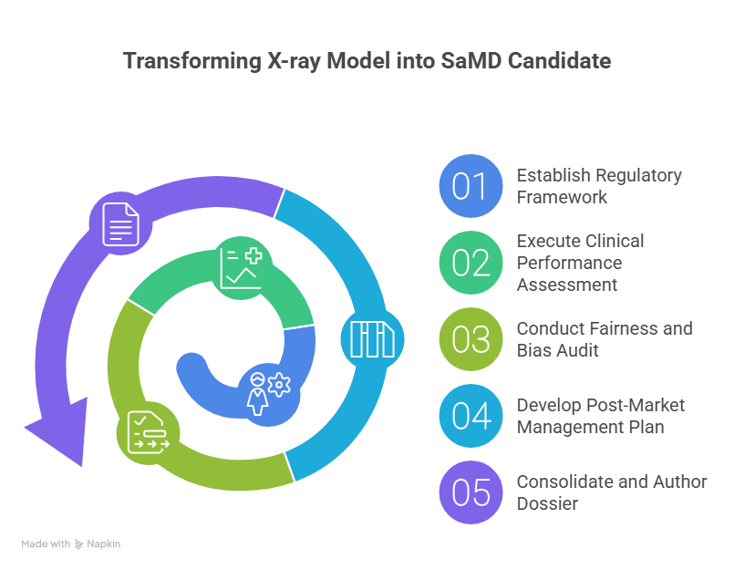

# AI Model Validation for Chest Radiograph Analysis


### Overview
This repository contains the full validation dossier for a deep learning model designed for diagnostic assistance in radiology. The project follows a framework aligned with regulatory standards for **Software as a Medical Device (SaMD)** to ensure a robust evaluation of the model's performance, safety, and fairness.

---

### Intended Use Statement
<table>
<tr>
<td style="border: 1px solid blue; border-radius: 10px; padding: 15px;">
<strong>This software is intended to be used by qualified radiologists to assist in the detection of cardiomegaly in adult (18+) frontal chest radiographs. It is not intended for standalone diagnostic use and should serve as a concurrent read tool.</strong>
</td>
</tr>
</table>

---

### Validation Process Overview
Here is a high-level overview of the validation methodology employed in this project.



---

### Project Goal & Details

The goal is to produce a comprehensive, publication-quality validation report for an AI model, demonstrating a robust process for:
* Clinical Performance Assessment
* Algorithmic Bias and Fairness Auditing
* Lifecycle and Monitoring Planning

| Detail | Description |
|---|---|
| **Technology Stack** | `Python 3.9`, `TensorFlow`, `Pandas`, `Scikit-learn`, `Vertex AI` |
| **Dataset** | NIH Chest X-ray Dataset |
| **Final Deliverable** | [Validation Dossier PDF](./reports/validation_report_final.pdf) |

---

### Installation and Usage
To replicate this analysis, please follow these steps:

1.  **Clone the repository:**
    ```bash
    git clone [https://github.com/](https://github.com/)[YourUsername]/[Your-Repo-Name].git
    cd [Your-Repo-Name]
    ```
2.  **Create and activate a virtual environment:**
    ```bash
    python -m venv venv
    source venv/bin/activate  # On Windows use `venv\Scripts\activate`
    ```
3.  **Install dependencies:**
    ```bash
    pip install -r requirements.txt
    ```
4.  **Run the analysis:**
    The primary analysis can be run via the main Jupyter Notebook:
    ```bash
    jupyter notebook notebooks/main_analysis.ipynb
    ```
---

### Project Structure
```mermaid
├── reports/
│   └── validation_report_final.pdf   # The final regulatory-style report
├── notebooks/
│   └── main_analysis.ipynb           # Main notebook for data analysis and validation
├── scripts/
│   └── data_preprocessing.py         # Scripts for data cleaning and preparation
├── images/
│   └── SaMD_Validation_dossier.png   # Diagrams and images for the README
├── .gitignore                        # Specifies files for Git to ignore
├── LICENSE                           # MIT License file
└── README.md                         # This file
```
---

### Acknowledgments
This project utilizes the NIH Chest X-ray Dataset, collected and made available by the **U.S. National Institutes of Health (NIH)**.

---

### Contact
For questions or collaborations, please connect with me on LinkedIn:

[](https://www.linkedin.com/in/drbalaji96/)
